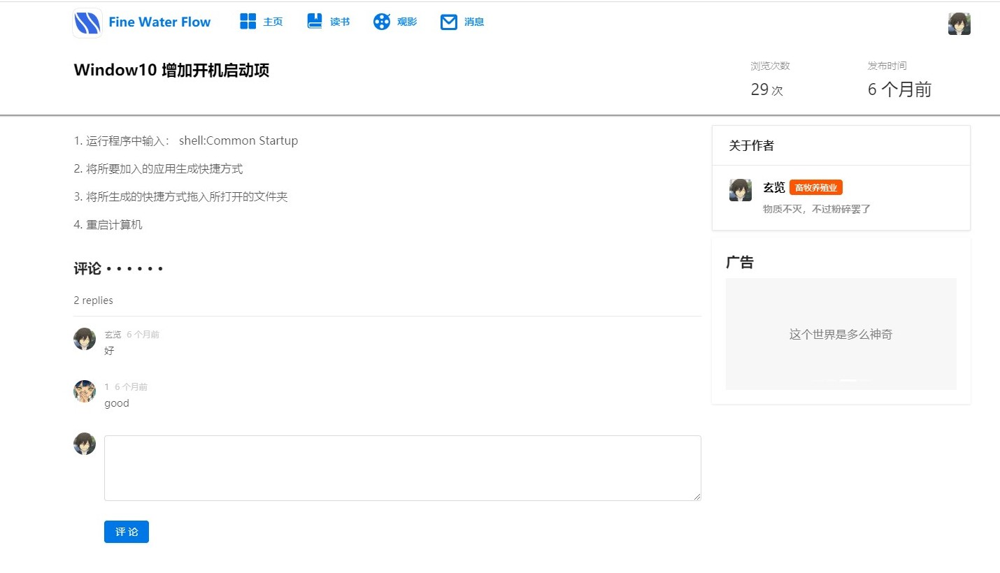
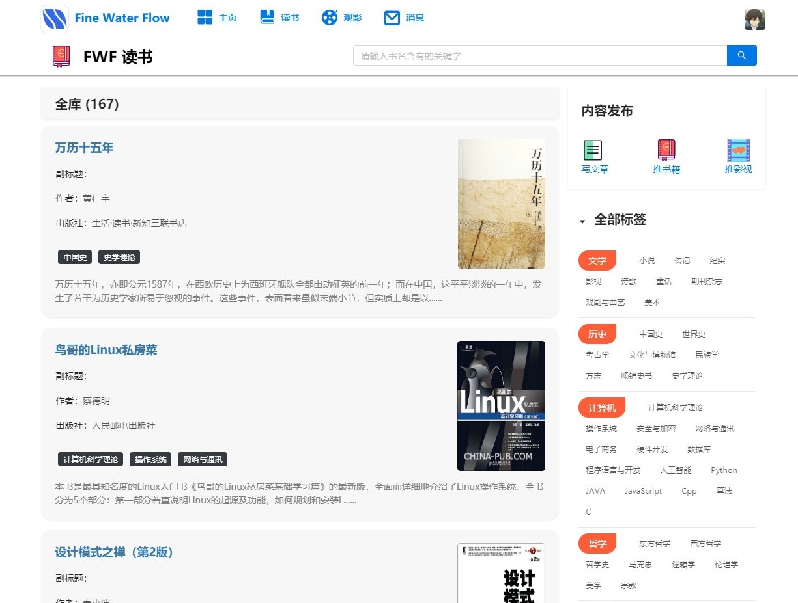

[README.md](./README.md) | [说明.md](./说明.md) 

# [Fine water flow](https://101.200.52.246:444/) &middot; [](https://github.com/facebook/react/blob/master/LICENSE)

FineWaterFlow 是通过React+Django开发的个人数据平台。

* **不易安装:** 这项目不怎么好安装，谨慎部署。其中后端开发在本地环境开发，前端开发在生产环境开发。

* **工具箱:** 平台拥有众多功能，且可以模块拓展。后续可以方便的拓展工具箱模块以开发个人小应用。

## 功能

1. 文章发布、查看、修改、删除、个人草稿箱以及文章评论；

2. 书籍管理数据库、评论；

3. 影视管理数据库、评论；
4. 站点通知；
5. 用户关注；
6. 广告位；
7. 用户积分排名；
8. 个人信息设置；
9. 工具箱：刷短文、JSON查看器、抽癞子、二维码、图表绘（开发中）、数码数据库、Adobe资源整合（开发中）

## 安装

### 前端

```bash
npm i
```

### 后端

```bash
pipenv install
```

## Usage


## License

Fine water flow is [BSD licensed](./LICENSE).
